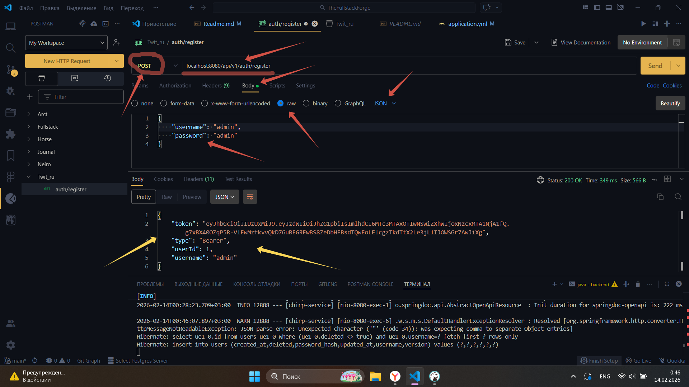
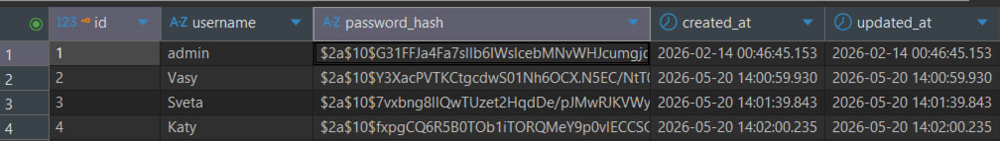
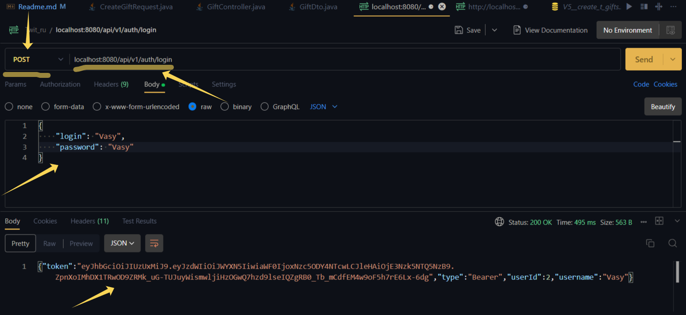
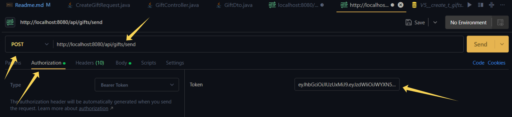
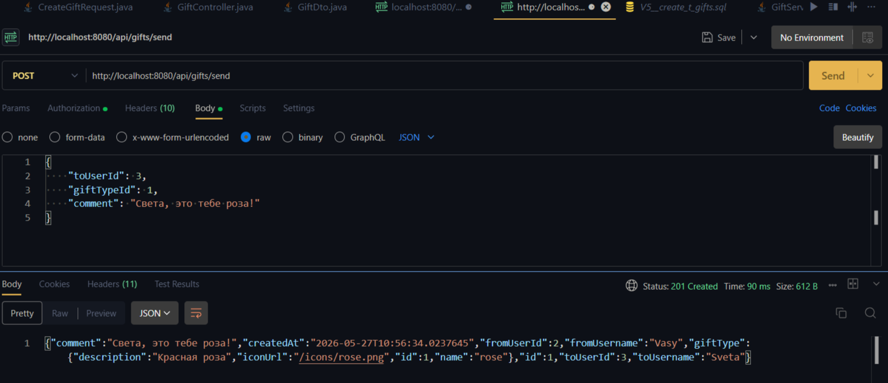

# The Fullstack Forge

Фулстек-Кузница

> 27.05.2026 (задача по подаркам)

- [Условие задачи](#Условие-задачи)
- [Процесс выполнения задачи](#Процесс-выполнения-задачи)
- [Процесс выполнения задачи "backend"](#Процесс-выполнения-задачи-backend)
- [Процесс выполнения задачи "frontend"](#Процесс-выполнения-задачи-frontend) 
- [Вопросы по задаче в процессе выполнения](#Вопросы-по-задаче-в-процессе-выполнения)

---

# Запуск приложений

> frontend

```
cd frontend
npm i
npm run dev
```

> backend
> Запуск с очисткой

```
cd backend
mvn clean spring-boot:run
```

Простой запуск

```
mvn spring-boot:run
```

---

# Условие задачи
Добавить механизм подарков и дать возможность пользователям его друг другу пересылать (по одному). Подарок должен иметь имя отправителя и комментарий

## Процесс выполнения задачи
### Процесс выполнения задачи "backend"
1. Зарегистрируем новых пользователей в системе для обмена подарками. Для регистрации будем использовать postman.Заходим в `Postman` и делаем 3 запроса, чтобы создать 3 новыйх пользователей. (Обратите внимание, сервера backend и frontend должны быть запущены):


Я зарегистрировал пользователей:
* Логин: Vasy Пароль: Vasy
* Логин: Sveta Пароль: Sveta
* Логин: Katy Пароль: Katy

Через `DBeaver` проверяем есть ли пользователи:


Пользователи зарегистрированы.

Далее создаём миграции, то есть создаём новые таблицы в БД для работы с подарками через приложение
- Заходим `src -> main -> resources -> db -> migration`:
```sql
CREATE TABLE IF NOT EXISTS gift_types ( -- таблица с подарками
    id BIGSERIAL PRIMARY KEY, -- id
    name VARCHAR(50) NOT NULL UNIQUE, -- название подарка
    description VARCHAR(200), -- Описание подарка
    icon_url VARCHAR(500), -- Путь до icon
    created_at TIMESTAMP DEFAULT CURRENT_TIMESTAMP -- Время создания
);

CREATE TABLE IF NOT EXISTS gifts ( -- Таблица связей подарков с users
    id BIGSERIAL PRIMARY KEY, -- id
    from_user_id BIGINT NOT NULL, -- id отправителя
    to_user_id BIGINT NOT NULL, -- id получателя
    gift_type_id BIGINT NOT NULL, -- id подарка
    comment VARCHAR(500), -- коммент к подарку
    created_at TIMESTAMP DEFAULT CURRENT_TIMESTAMP, -- время создания
    
    CONSTRAINT fk_gifts_from_user FOREIGN KEY (from_user_id) REFERENCES users(id) ON DELETE CASCADE, -- CONSTRAINT - правило, ограничение. fk_gifts_from_user - имя правила FOREIGN KEY (from_user_id) Указывает, что поле from_user_id в таблице gifts - это внешний ключ. Его значения должны существовать в другой таблице. REFERENCES users(id). Ссылается на поле id в таблице users. То есть from_user_id в gifts = id в users. Что делать при удалении пользователя CASCADE - удалить все подарки этого пользователя
    CONSTRAINT fk_gifts_to_user FOREIGN KEY (to_user_id) REFERENCES users(id) ON DELETE CASCADE,
    CONSTRAINT fk_gifts_gift_type FOREIGN KEY (gift_type_id) REFERENCES gift_types(id)
);

-- Индексы для быстрых запросов
CREATE INDEX idx_gifts_to_user ON gifts(to_user_id); // -- Создает быстрый справочник для поиска по полю to_user_id
CREATE INDEX idx_gifts_from_user ON gifts(from_user_id);
CREATE INDEX idx_gifts_created_at ON gifts(created_at);

-- Добавляем базовые типы подарков
INSERT INTO gift_types (name, description, icon_url) VALUES -- Заполнение полей 
('rose', 'Красная роза', '/icons/rose.png'),
('cake', 'Праздничный торт', '/icons/cake.png'),
('bear', 'Плюшевый мишка', '/icons/bear.png'),
('heart', 'Валентинка', '/icons/heart.png'),
('star', 'Звезда', '/icons/star.png'),
('coffee', 'Чашка кофе', '/icons/coffee.png'),
('flower', 'Букет цветов', '/icons/flower.png'),
('chocolate', 'Коробка конфет', '/icons/chocolate.png');
ON CONFLICT (name) DO NOTHING; --Пропуск, если такие данные в базе существуют
```

Проверяем через DBeaver, что записи и таблицы появились. Если всё успешно, продолжаем. Успешный запуск:


Далее создаём модель под тип подарков, переходим `src/main/java/ru/parus/chirp/model` и создаём `GiftTypeEntity.java`:
```java
package ru.parus.chirp.model; // Указание, где находится класс

import jakarta.persistence.*; // Подключение @Table, @Id, GenerationType и т.д.
import lombok.Data; // @Data
import java.time.LocalDateTime; // Для created_at

@Data
@Entity // Соответствие БД
@Table(name = "gift_types")
public class GiftTypeEntity {
    @Id
    @GeneratedValue(strategy = GenerationType.IDENTITY)
    private Long id;

    @Column(name  = "name", nullable = false)
    private String name;

    private String description;

    @Column(name = "icon_url")
    private String iconUrl;

    @Column(name = "created_at")
    private LocalDateTime createdAt;
}
```

Далее создаём сущность entity для Gift. Переходим `src/main/java/ru/parus/chirp/model` и создаём `GiftEntity`:
```java
package ru.parus.chirp.model;

import jakarta.persistence.*;
import lombok.Data;
import java.time.LocalDateTime;

@Data
@Entity
@Table(name = "gifts")
public class GiftEntity {
    
    @Id
    @GeneratedValue(strategy = GenerationType.IDENTITY)
    private Long id;
    
    @Column(name = "from_user_id", nullable = false)
    private Long fromUserId;
    
    @Column(name = "to_user_id", nullable = false)
    private Long toUserId;
    
    @Column(name = "gift_type_id", nullable = false)
    private Long giftTypeId;
    
    private String comment;
    
    @Column(name = "created_at")
    private LocalDateTime createdAt;
}
```

Далее описываем `dto`, создаём в папке `model -> dto` папку gift:
* И создаём файл `GiftTypeDto.java`
```java
package ru.parus.chirp.model.dto.gift;

import lombok.Data;

@Data
public class GiftTypeDto {
    private Long id;
    private String name;
    private String description;
    private String iconUrl;
}
```

* Создаём файл `GiftDto.java`
```java
package ru.parus.chirp.model.dto.gift;

import lombok.Data;
import java.time.LocalDateTime;

@Data
public class GiftDto {
    private Long id;
    private Long fromUserId;
    private String fromUsername;
    private Long toUserId;
    private String toUsername;
    private GiftTypeDto giftType;
    private String comment;
    private LocalDateTime createdAt;
}
```

Далее важный файл для работы с интерфейсом, подключается методы к БД:
Переходим `src/main/java/ru/parus/chirp/repository/` и создаём файл `GiftTypeRepository.java`:
```java
package ru.parus.chirp.repository;

import org.springframework.data.jpa.repository.JpaRepository;
import ru.parus.chirp.model.GiftTypeEntity;

public interface GiftTypeRepository extends JpaRepository<GiftTypeEntity, Long> {
}
```

И создаём там же `GiftRepository.java`:
```java
package ru.parus.chirp.repository;

import org.springframework.data.domain.Page;
import org.springframework.data.domain.Pageable;
import org.springframework.data.jpa.repository.JpaRepository;
import ru.parus.chirp.model.GiftEntity;

public interface GiftRepository extends JpaRepository<GiftEntity, Long> {
    
    // Найти все подарки, где пользователь - ПОЛУЧАТЕЛЬ
    Page<GiftEntity> findByToUserIdOrderByCreatedAtDesc(Long toUserId, Pageable pageable);
    
    // Найти все подарки, где пользователь - ОТПРАВИТЕЛЬ
    Page<GiftEntity> findByFromUserIdOrderByCreatedAtDesc(Long fromUserId, Pageable pageable);
}
```

Создаём преобразователь Entity в Dto и обратно, по пути `src/main/java/ru/parus/chirp/mapper` создаём `GiftMapper.java`:
```java
package ru.parus.chirp.mapper;

import lombok.RequiredArgsConstructor;
import org.springframework.stereotype.Component;
import ru.parus.chirp.model.GiftEntity;
import ru.parus.chirp.model.GiftTypeEntity;
import ru.parus.chirp.model.UserEntity;
import ru.parus.chirp.model.dto.gift.GiftDto;
import ru.parus.chirp.model.dto.gift.GiftTypeDto;
import ru.parus.chirp.repository.GiftTypeRepository;
import ru.parus.chirp.repository.UserRepository;

@Component
@RequiredArgsConstructor
public class GiftMapper {
    
    private final UserRepository userRepository;
    private final GiftTypeRepository giftTypeRepository;
    
    public GiftDto toDto(GiftEntity entity) {
        if (entity == null) return null;
        
        GiftDto dto = new GiftDto();
        dto.setId(entity.getId());
        dto.setFromUserId(entity.getFromUserId());
        dto.setToUserId(entity.getToUserId());
        dto.setComment(entity.getComment());
        dto.setCreatedAt(entity.getCreatedAt());
        
        // Получаем имя отправителя
        UserEntity fromUser = userRepository.findById(entity.getFromUserId()).orElse(null);
        if (fromUser != null) {
            dto.setFromUsername(fromUser.getUsername());
        }
        
        // Получаем имя получателя
        UserEntity toUser = userRepository.findById(entity.getToUserId()).orElse(null);
        if (toUser != null) {
            dto.setToUsername(toUser.getUsername());
        }
        
        // Получаем тип подарка
        GiftTypeEntity giftType = giftTypeRepository.findById(entity.getGiftTypeId()).orElse(null);
        if (giftType != null) {
            GiftTypeDto typeDto = new GiftTypeDto();
            typeDto.setId(giftType.getId());
            typeDto.setName(giftType.getName());
            typeDto.setDescription(giftType.getDescription());
            typeDto.setIconUrl(giftType.getIconUrl());
            dto.setGiftType(typeDto);
        }
        
        return dto;
    }
}
```

Создаём интерфейс, то есть описываем все методы, которые будут осуществлять работу приложения. По пути `src/main/java/ru/parus/chirp/service` создаём файл `GiftService.java`:
```java
package ru.parus.chirp.service;

import org.springframework.data.domain.Page;
import org.springframework.data.domain.Pageable;
import ru.parus.chirp.model.dto.gift.CreateGiftRequest;
import ru.parus.chirp.model.dto.gift.GiftDto;

public interface GiftService {
    
    GiftDto sendGift(CreateGiftRequest request);
    
    Page<GiftDto> getMyReceivedGifts(Pageable pageable);
    
    Page<GiftDto> getMySentGifts(Pageable pageable);
    
    GiftDto getGiftById(Long id);
}
```

Создаём сам файл с методами, работой методов: `src/main/java/ru/parus/chirp/service/impl` создаём файл `GiftServiceImpl.java`:
```java
package ru.parus.chirp.service.impl;

import lombok.RequiredArgsConstructor;
import lombok.extern.slf4j.Slf4j;
import org.springframework.data.domain.Page;
import org.springframework.data.domain.PageImpl;
import org.springframework.data.domain.Pageable;
import org.springframework.stereotype.Service;
import org.springframework.transaction.annotation.Transactional;
import ru.parus.chirp.exception.NotExistException;
import ru.parus.chirp.mapper.GiftMapper;
import ru.parus.chirp.model.GiftEntity;
import ru.parus.chirp.model.UserEntity;
import ru.parus.chirp.model.dto.gift.CreateGiftRequest;
import ru.parus.chirp.model.dto.gift.GiftDto;
import ru.parus.chirp.repository.GiftRepository;
import ru.parus.chirp.repository.GiftTypeRepository;
import ru.parus.chirp.service.GiftService;
import ru.parus.chirp.service.UserService;

import java.time.LocalDateTime;

@Slf4j
@Service
@RequiredArgsConstructor
public class GiftServiceImpl implements GiftService {
    
    private final GiftRepository giftRepository;
    private final GiftTypeRepository giftTypeRepository;
    private final GiftMapper giftMapper;
    private final UserService userService;
    
    @Override
    @Transactional
    public GiftDto sendGift(CreateGiftRequest request) {  // ← Принимаем объект
        UserEntity currentUser = userService.getCurrentUserEntity();
        
        // Извлекаем данные из объекта request
        Long toUserId = request.getToUserId();        // ← получаем ID получателя
        Long giftTypeId = request.getGiftTypeId();    // ← получаем ID типа подарка
        String comment = request.getComment();        // ← получаем комментарий
        
        // Проверяем существование получателя
        UserEntity toUser = userService.getUserEntityById(toUserId);
        if (toUser == null) {
            throw new NotExistException("Получатель не найден");
        }
        
        // Проверяем существование типа подарка
        if (!giftTypeRepository.existsById(giftTypeId)) {
            throw new NotExistException("Тип подарка не найден");
        }
        
        // Нельзя отправить подарок самому себе
        if (currentUser.getId().equals(toUserId)) {
            throw new IllegalArgumentException("Нельзя отправить подарок самому себе");
        }
        
        // Создаем подарок
        GiftEntity gift = new GiftEntity();
        gift.setFromUserId(currentUser.getId());
        gift.setToUserId(toUserId);
        gift.setGiftTypeId(giftTypeId);
        gift.setComment(comment);
        gift.setCreatedAt(LocalDateTime.now());
        
        GiftEntity saved = giftRepository.save(gift);
        log.info("Подарок отправлен: от {} к {}", currentUser.getId(), toUserId);
        
        return giftMapper.toDto(saved);
    }
    
    @Override
    @Transactional(readOnly = true)
    public Page<GiftDto> getMyReceivedGifts(Pageable pageable) {
        UserEntity currentUser = userService.getCurrentUserEntity();
        Page<GiftEntity> gifts = giftRepository.findByToUserIdOrderByCreatedAtDesc(
                currentUser.getId(), pageable);
        
        return new PageImpl<>(
                gifts.getContent().stream()
                        .map(giftMapper::toDto)
                        .toList(),
                pageable,
                gifts.getTotalElements()
        );
    }
    
    @Override
    @Transactional(readOnly = true)
    public Page<GiftDto> getMySentGifts(Pageable pageable) {
        UserEntity currentUser = userService.getCurrentUserEntity();
        Page<GiftEntity> gifts = giftRepository.findByFromUserIdOrderByCreatedAtDesc(
                currentUser.getId(), pageable);
        
        return new PageImpl<>(
                gifts.getContent().stream()
                        .map(giftMapper::toDto)
                        .toList(),
                pageable,
                gifts.getTotalElements()
        );
    }
    
    @Override
    @Transactional(readOnly = true)
    public GiftDto getGiftById(Long id) {
        GiftEntity gift = giftRepository.findById(id)
                .orElseThrow(() -> new NotExistException("Подарок не найден"));
        return giftMapper.toDto(gift);
    }
}
```

Остался последний шаг. Создаём по пути `src/main/java/ru/parus/chirp/controller` файл `GiftController.java`:
```java
package ru.parus.chirp.controller;

import lombok.RequiredArgsConstructor;
import org.springframework.data.domain.Page;
import org.springframework.data.domain.Pageable;
import org.springframework.data.web.PageableDefault;
import org.springframework.http.HttpStatus;
import org.springframework.web.bind.annotation.*;
import ru.parus.chirp.model.dto.gift.CreateGiftRequest;
import ru.parus.chirp.model.dto.gift.GiftDto;
import ru.parus.chirp.service.GiftService;
import jakarta.validation.Valid;

@RestController
@RequestMapping("/api/gifts")
@RequiredArgsConstructor
public class GiftController {
    
    private final GiftService giftService;
    
    @PostMapping("/send")
    @ResponseStatus(HttpStatus.CREATED)
    public GiftDto sendGift(@Valid @RequestBody CreateGiftRequest request) {
        return giftService.sendGift(request);
    }
    
    @GetMapping("/received")
    public Page<GiftDto> getMyReceivedGifts(@PageableDefault(size = 20) Pageable pageable) {
        return giftService.getMyReceivedGifts(pageable);
    }
    
    @GetMapping("/sent")
    public Page<GiftDto> getMySentGifts(@PageableDefault(size = 20) Pageable pageable) {
        return giftService.getMySentGifts(pageable);
    }
    
    @GetMapping("/{id}")
    public GiftDto getGiftById(@PathVariable Long id) {
        return giftService.getGiftById(id);
    }
}
```

Для правильной работы надо написать метод поиска user по id, для этого переходим `src/main/java/ru/parus/chirp/service/UserService.java` и дописываем строку: 
```java
UserEntity getUserEntityById(Long id);
```

Создаём файл для преобразования json-файла в java-данные. По пути `src/main/java/ru/parus/chirp/model/dto/gift` создаём файл `CreateGiftRequest.java`:
```java
package ru.parus.chirp.model.dto.gift;

import lombok.Data;

@Data
public class CreateGiftRequest {
    private Long toUserId;
    private Long giftTypeId;
    private String comment;
}
```

Далее тестим, запускаем postman и получаем token для пользователя Vasy, как-будто мы через него зашли, заполняем в postman:


После нажатия на кнопку send, в ответе появится token, его копируем и создаём новый запрос в postman:


в поле type выбираем `Bearer Token`, в поле `Token` вставляем что скопировали из предыдущего запроса `token`. Далее в меню выбираем `Body` -> `raw`, слева меняем на `JSON` и вставляем:
```json
{
    "toUserId": 3,
    "giftTypeId": 1,
    "comment": "Света, это тебе роза!"
}
```

пример, как должен выглядеть запрос и нажимаем send:



Должен прийти ответ на ваш запрос и в БД появится в таблице `gifts` новая запись. Если появилось так как и в картинке запроса выше, то всё успешно. Работает. Переходим к подключению `frontend`.

### Процесс выполнения задачи "frontend"

# Вопросы по задаче в процессе выполнения
1. При добавлении новых записей в БД через миграцию - при повторном запуске дублируют созданные записи, как исправить?
К этой записи: `INSERT INTO gift_types (name, description, icon_url) VALUES`, добавить: `ON CONFLICT (name) DO NOTHING;`

2. 